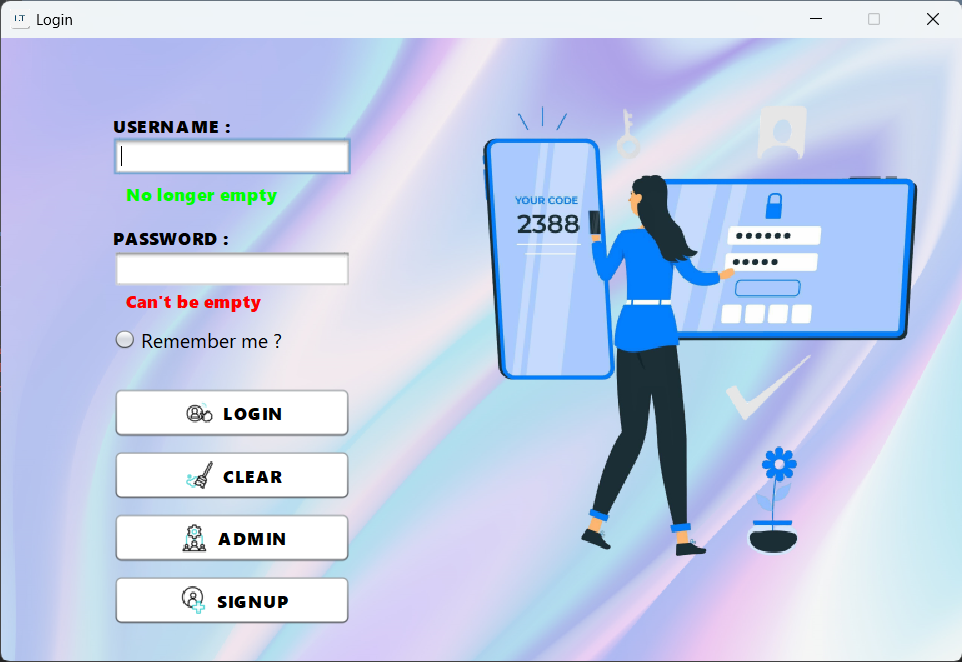
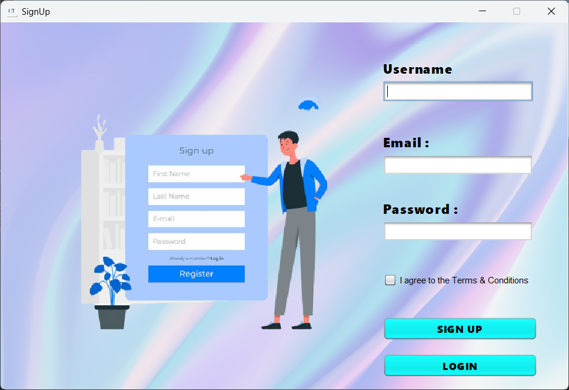
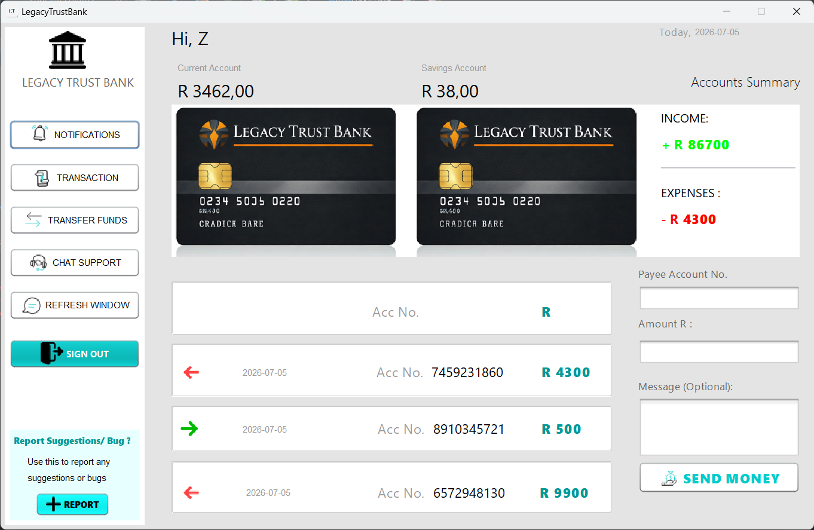
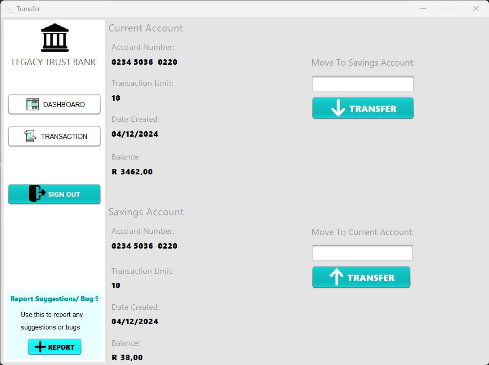
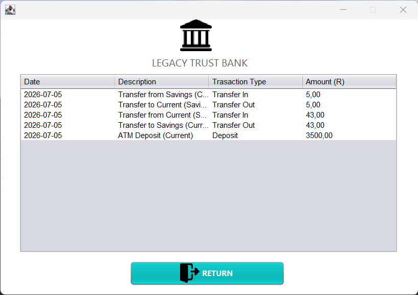
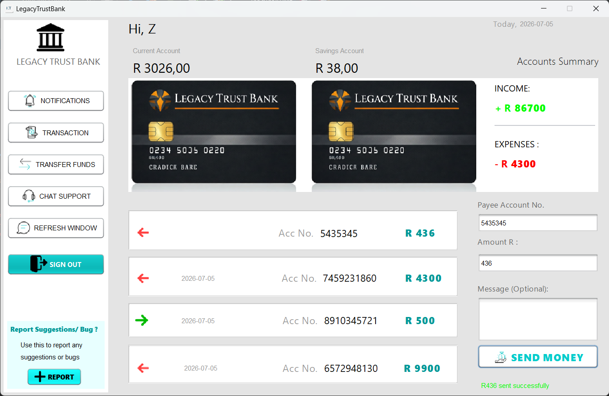
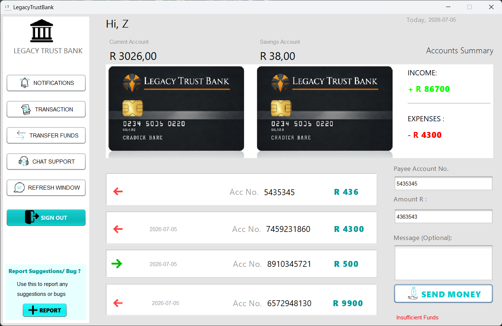
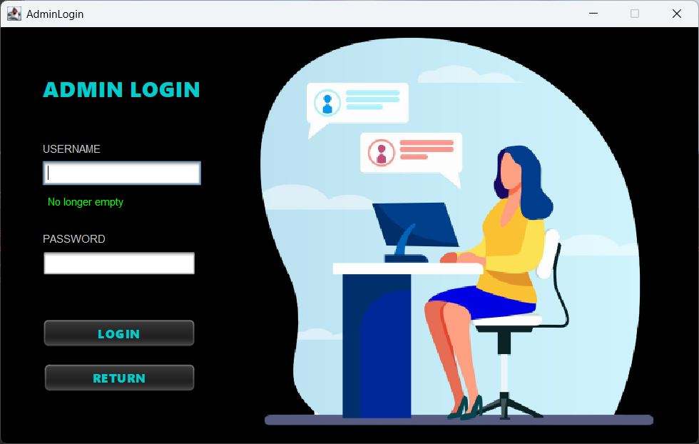
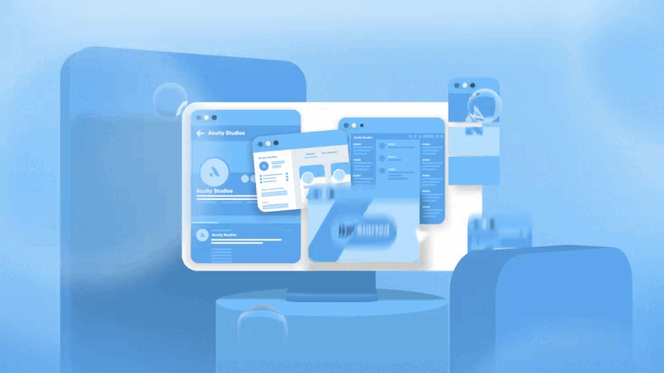

# Legacy Trust Bank

A desktop banking application built with Java Swing. Users can register, log in, manage a Current and Savings account, transfer funds, send money, and view full transaction history. An admin panel and a companion ATM application are also included.

---

## Screenshots

### Login


### Sign Up


### Dashboard


### Transfer Funds


### Transaction History


### Successful Payment


### Insufficient Funds


### Admin Login




---

## Features

- User registration and login
- Current and Savings account management
- Transfer funds between your own accounts
- Send money to other registered users
- Full transaction history
- Admin panel
- Companion ATM app — deposit, withdraw, check balance, and send money
- Shared local SQLite database between the bank app and ATM

---

## Tech Stack

| | |
|---|---|
| Language | Java (JDK 11+) |
| UI | Java Swing (NetBeans GUI Builder) |
| Database | SQLite via [xerial/sqlite-jdbc](https://github.com/xerial/sqlite-jdbc) |
| Build | Apache Ant |
| IDE | Apache NetBeans |

---

## Getting Started

### Prerequisites

- JDK 11 or higher
- Apache NetBeans (recommended)
- SQLite JDBC driver — already included in `lib/sqlite-jdbc-3.53.2.0.jar`

### Setup

1. **Clone the repo**
   ```bash
   git clone https://github.com/your-username/LegacyTrustBank.git
   ```

2. **Open in NetBeans**
   - File → Open Project → select the `LegacyTrustBank` folder
   - NetBeans will detect it as an Ant project automatically

3. **Add the SQLite JDBC driver to the project**
   - Right-click the project → Properties → Libraries → Add JAR/Folder
   - Select `lib/sqlite-jdbc-3.53.2.0.jar`

4. **Run the project**
   - Set `Login.java` as the main class
   - Press Run — the database is created automatically at first launch

5. **Create an account**
   - Click **Sign Up** on the login screen to register

> No database server or configuration needed. The database (`bankdata.db`) is generated automatically at `C:\ProgramData\LegacyTrustBank\bankdata.db` and is shared between the bank app and the ATM.

---

## ATM Application

The ATM is a separate companion app located in the `ATM/` folder. It connects to the same shared database, so any account created in the bank app works directly in the ATM.

### ATM Features
- PIN login using your bank app credentials
- Check balance (Current account)
- Deposit to Current or Savings
- Withdraw from Current or Savings
- Send money to other registered users

### Running the ATM
1. Open the `ATM/` folder as a separate NetBeans project
2. Add `ATM/lib/sqlite-jdbc-3.53.2.0.jar` to the ATM project libraries
3. Set `AtmLogin.java` as the main class
4. Run — log in with the same username and password used in the bank app

---

## Project Structure

```
LegacyTrustBank/
├── src/legacytrustbank/
│   ├── Login.java              — Entry point and authentication
│   ├── SignUp.java             — New user registration
│   ├── BankUI.java             — Main dashboard
│   ├── Transfer.java           — Transfer between accounts
│   ├── Transactions.java       — Transaction history
│   ├── AdminLogin.java         — Admin panel
│   └── SupabaseService.java    — All database logic (SQLite)
│
├── ATM/src/atm/
│   ├── AtmLogin.java           — ATM PIN login
│   ├── AtmMachine.java         — Main ATM menu
│   ├── CheckBalance.java       — Balance screen with deposit/withdraw
│   └── DatabaseService.java    — Shared database logic (same DB as bank app)
│
├── lib/
│   └── sqlite-jdbc-3.53.2.0.jar
│
└── screenshots/
```

---

## Database

The app uses SQLite — no setup required. The database file is auto-generated on first run.

**Location:** `C:\ProgramData\LegacyTrustBank\bankdata.db`

**Tables:**

| Table | Description |
|---|---|
| `users` | Registered user accounts |
| `accounts` | Current and Savings balances per user |
| `transactions` | Full transaction history |

To inspect the database visually, use [DB Browser for SQLite](https://sqlitebrowser.org) — free and open source.
